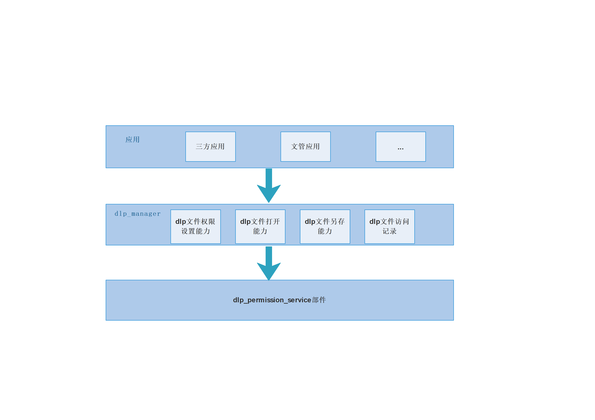

# DLP权限管理应用


## 简介

数据防泄漏（DLP: data_leak_prevention）是通过一系列安全保护技术，实现文档的权限管理功能，保证权限文档的安全性。终端用户给指定文件添加权限保护，给指定终端用户添加只读编辑权限。添加完成后，DLP权限管理应用生成权限保护文件（DLP文件）。权限保护设置完成后，权限保护文件只有指定终端用户可以打开。

DLP权限管理部件架构图如下所示：


主要流程说明：

- 三方应用如何调用：三方应用通过调用startAbility拉起DLP权限管理应用。参数传递bundleName为com.ohos.dlpmanager,abilityName为MainAbility。

- 生成DLP文件：通过三方应用或者文管应用，点击设置权限或者加密保护，打开DLP应用管理页面，在加密保护页面的只读和编辑输入框输入终端用户的域账号，点击确定，完成加密保护，生成DLP文件。
- 更改DLP文件权限：通过三方应用或者文管应用，点击设置权限或者加密保护，对于DLP文件，打开更改加密页面，可以点击解除加密功能和更改加密功能，实现对已有的DLP文件的加密更改。

## 目录

```
/applications/standard/dlp_manager
├── AppScope                           # 项目资源
│   ├──resources                       # 资源
│   │       ├──base                    # 英文资源
│   │       ├──zh_CN                   # 中文资源
│   ├──app.json                        # 应用的全局配置信息
├── entry                              # 工程模块，编译构建生成一个HAP包
│   ├── src/main/ets                   # 用于存放ArkTS源码
│   │       ├── AlertAbility           # alert弹窗服务
│   │       ├── common                 # 公共工具目录
│   │       ├── DataAbility            # 监控历史服务
│   │       ├── MainAbility            # 应用服务的入口
│   │       └── pages                  # 页面目录
│   │       └── SaveAsAbility          # 另存为服务
│   │       └── ViewAbility            # 打开dlp文件目录
│   └──  src/main
│   │       ├──resources               # 全局资源文件目录
│   │       ├──module.json5            # 全局配置文件
├── figures                            # README图片存放目录
├── signature                          # 证书文件目录
└── LICENSE                            # 许可文件
```

## 安装、运行、调试

### 应用安装

- 代码编译有两个文件需要将后缀名修改为json5

```
/AppScope/app.json
/dlp_manager/src/main/module.json
```

- 初次安装需要卸载系统预置的DLP权限管理

```
hdc shell mount -o remount,rw /
hdc shell rm -rf /system/app/DlpManager
hdc shell rm -rf /data/*
hdc shell reboot
```

- 安装签过名的hap包

```
hdc install 包路径
```

- DLP权限管理

文件管理-右键选择加密保护-DLP权限管理

### 应用调试

- 在程序中添加 log

```JS
const TAG = "DLPManager_Log"
console.info(TAG + `log`);
```
- 抓取log日志：

```
hdc shell hilog -Q pidoff
hdc shell -b D
hdc shell hilog -r && hdc hilog > log.txt
```

## 相关仓

**applications_dlp_manager**
